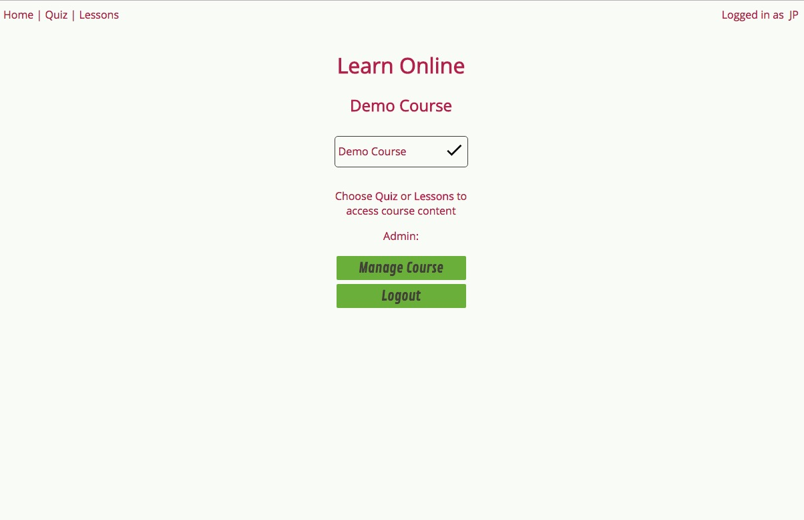
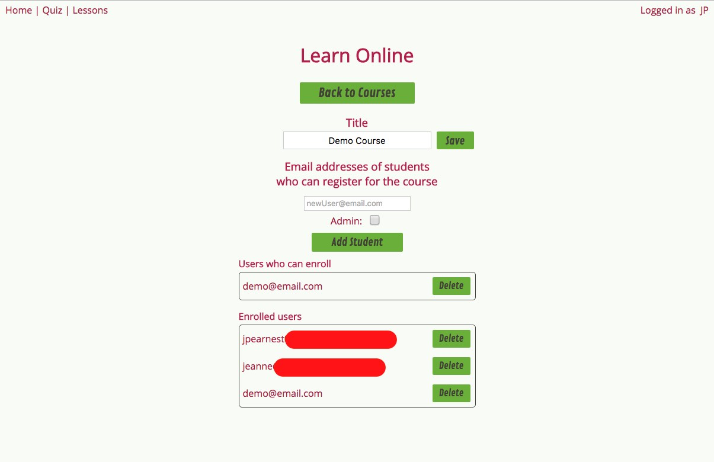

# eLearn

eLearn is a simple online learning platform, offering the ability to reach students with lessons and multiple choice quizzes. Passing all quizzes for a course enables a student to download a certificate of completion for the course.

##Features

1. **Courses**

  - Each course has an independent list of quizzes
  - Student can be pre-enrolled in course, before student even registers (student email needed)
  - Student can be enrolled in multiple courses
  - Course admin can unenroll registered or unregistered (pre-enrolled) students
  - Student can view list of all enrolled courses, and whether course has been passed
  - Student can download certificate of completion upon passing course

2. **Multiple choice quizzes**

  - Course admin can edit quiz
  - Quiz is automatically graded upon submission
  - Course admin sets minimum score needed to pass quiz
  - Student can see their highest score achieved on quiz, and score of last attempt
  - Student can see if they passed quiz
  - Student can see list of course quizzes, and which ones they have passed

3. **Lessons**

  - PDF lessons are listed for course
  - Lessons are stored in BOX currently (provides document version control)
  - Authenticated users can easily preview and download PDF lessons

##Technologies

| **Tech** | **Description** |
|----------|-------|
|  React  |   Javascript framework for single page apps   |
|  Redux  |   Application state management for react    |
|  Express  |   Server framework for Node   |
|  MongoDB  |   No-SQL database    |
|  BOX  |   Cloud fileserver   |

## ToDo:
This app is under construction.
* High priority
  * Enable course admin to create, update and delete course files
  * Enable course admin to view enrolled students quiz attempts and scores

* Enable site admin to create and delete courses (currently done through server code)
* Enable delivery of video lessons
* Create discussion board for each course
* Use cookies for authentication

Longer term:
* Create course sections, with discussion board for each section
* Create discussion board for each lesson for each section
* Enable alternative assessments, such as short answer, select all and matching questions
  * Develop automatic grading for each of these
* Enable mid-lesson questions to be introduced in video lessons
* Display detailed student performance stats and assessment item analysis to course admin

##
Copyright (c) 2017 JP Earnest
