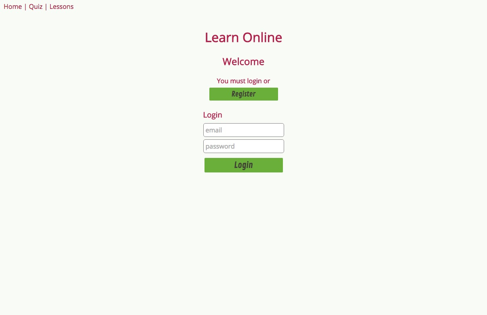
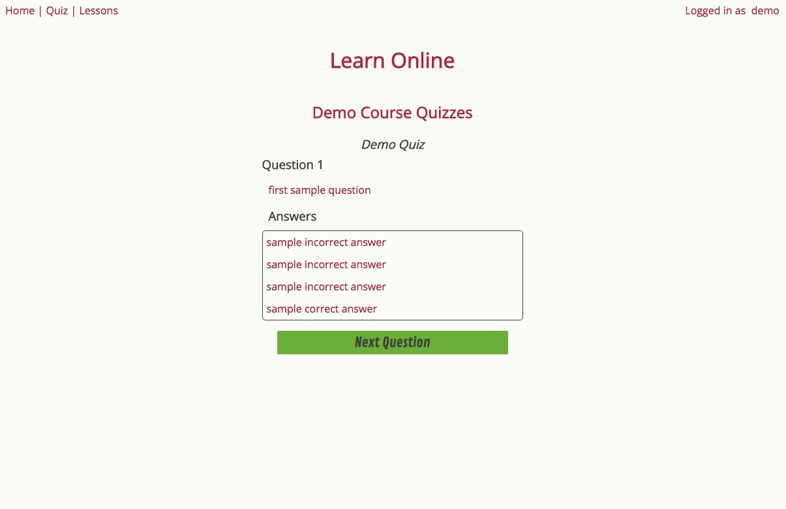
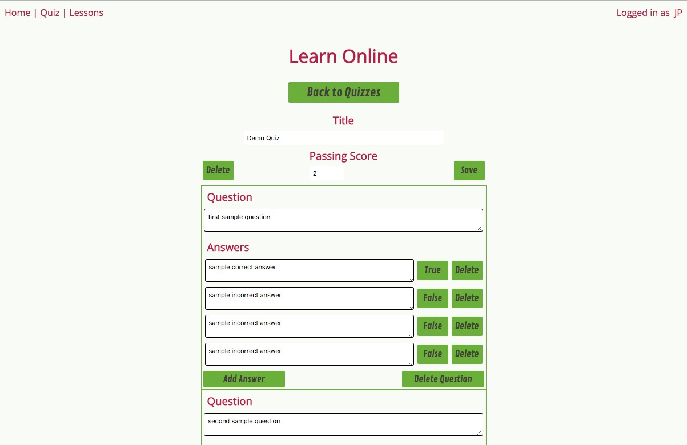
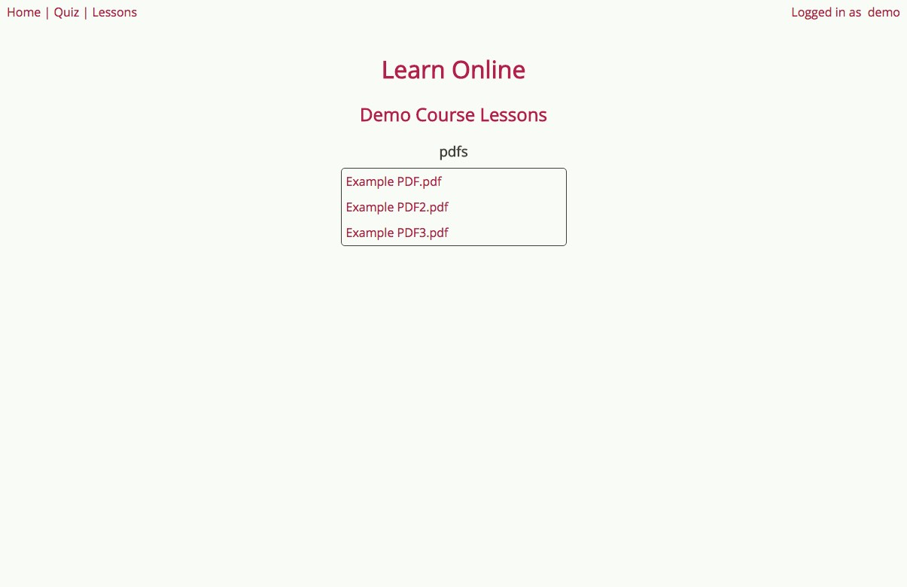

# eLearn

eLearn is a simple online learning platform, offering the ability to reach students with lessons and multiple choice quizzes. Passing all quizzes for a course enables a student to download a certificate of completion for the course.

## Features

**Courses**
  - Each course has an independent list of quizzes
  - Student can be pre-enrolled in course, before student even registers (student email needed)
  - Student can be enrolled in multiple courses
  - Course admin can unenroll registered or unregistered (pre-enrolled) students
  - Student can view list of all enrolled courses, and whether course has been passed
  - Student can download certificate of completion upon passing course

**Multiple choice quizzes**

  - Course admin can edit quiz
  - Quiz is automatically graded upon submission
  - Course admin sets minimum score needed to pass quiz
  - Student can see their highest score achieved on quiz, and score of last attempt
  - Student can see if they passed quiz
  - Student can see list of course quizzes, and which ones they have passed

**Lessons**

  - PDF lessons are listed for course
  - Lessons are stored in BOX currently (provides document version control)
  - Authenticated users can easily preview and download PDF lessons

##Technologies

| **Tech** | **Description** |
|----------|-------|
|  [React](https://facebook.github.io/react/)  |   Javascript framework for single page apps   |
|  [Redux](http://redux.js.org/)  |   Application state management for react    |
|  [Express](http://expressjs.com/)  |   Server framework for Node   |
|  [MongoDB](https://www.mongodb.com/)  |   No-SQL database    |
|  [BOX](https://docs.box.com/reference)  |   Cloud fileserver   |

## API
POST /users/currentuser :: register a new user, generates json web token valid for 24 hours
 - requires name, email and password in request body

PUT /users :: unroll a user from a course
 - must provide valid json web token through bearer strategy
 - must be course admin to submit request
 - requires user email and course id in request body

GET /users/certificate/:courseId/:jsonWebToken :: get certificate of completion for course

POST /login :: logs in user, generates json web token valid for 24 hours
 - requires user email and password in request body

GET /course/enrollable/:courseId :: gets enrolled and enrollable users of a course
 - must be course admin to make request
 - must provide valid json web token through bearer strategy

POST /course/enrollable :: adds unregistered user email to list of emails enrollable in a course
 - must be course admin to make request
 - requires course id, unregistered user email and admin boolean, indicating if user should be listed as a course admin, in request body
 - must provide valid json web token through bearer strategy

DELETE /course/enrollable :: removes unregistered user email from list of emails enrollable in course
 - must be course admin to make request
 - requires course id, and unregistered user email in request body
 - must provide valid json web token through bearer strategy

PUT /course :: updates course
 - currently only supports updating course name
 - must be course admin to make request
 - requires course id and updated course name in request body
 - must provide valid json web token through bearer strategy

GET /quiz/:quizId/:userId :: returns quiz and any submissions of quiz by user
  - must provide valid json web token through bearer strategy

PUT /quiz :: creates or updates quiz; new quiz is listed to course
 - must be course admin to make request
 - requires course id, quiz id, title, courses, items, and minimumScore in request body
 - must provide valid json web token through bearer strategy

DELETE /quiz/:quizId/:courseId :: deletes quiz, and removes quiz listing from course
 - must be course admin to make request
 - must provide valid json web token through bearer strategy

POST /quiz/submit :: records quiz submission by user
 - requires quizData (quiz submision), quiz id, user id in request body
 - must provide valid json web token through bearer strategy

GET /lessons :: get lists of lessons in BOX folder (will make specific BOX folder for each course in future)
 - must provide valid json web token through bearer strategy

GET /lessons/:BOXFileId :: get BOX preview and download url of lesson pdf
 - must provide valid json web token through bearer strategy

POST /lessons :: uploads lesson to course
 - not yet implmented

## ToDo:
This app is under construction.
* High priority
  * Enable course admin to create, update and delete course files
  * Enable course admin to view enrolled students quiz attempts and scores

* Enable site admin to create and delete courses (currently done through server code)
* Enable delivery of video lessons
* Create discussion board for each course
* Use cookies for authentication

Longer term:
* Create course sections, with discussion board for each section
* Create discussion board for each lesson for each section
* Enable alternative assessments, such as short answer, select all and matching questions
  * Develop automatic grading for each of these
* Enable mid-lesson questions to be introduced in video lessons
* Display detailed student performance stats and assessment item analysis to course admin

##
Copyright (c) 2017 JP Earnest
